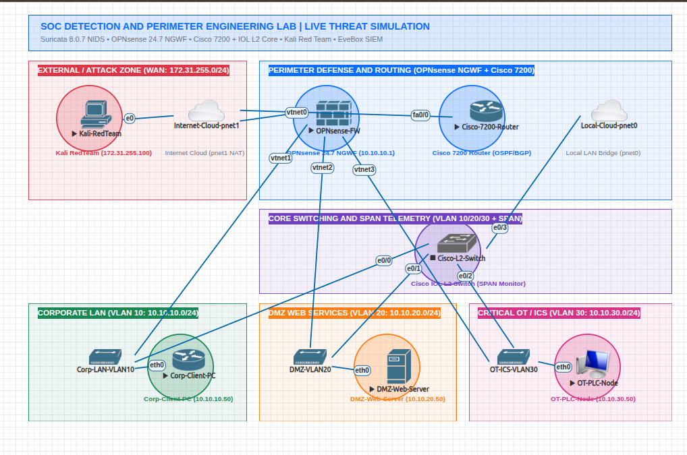
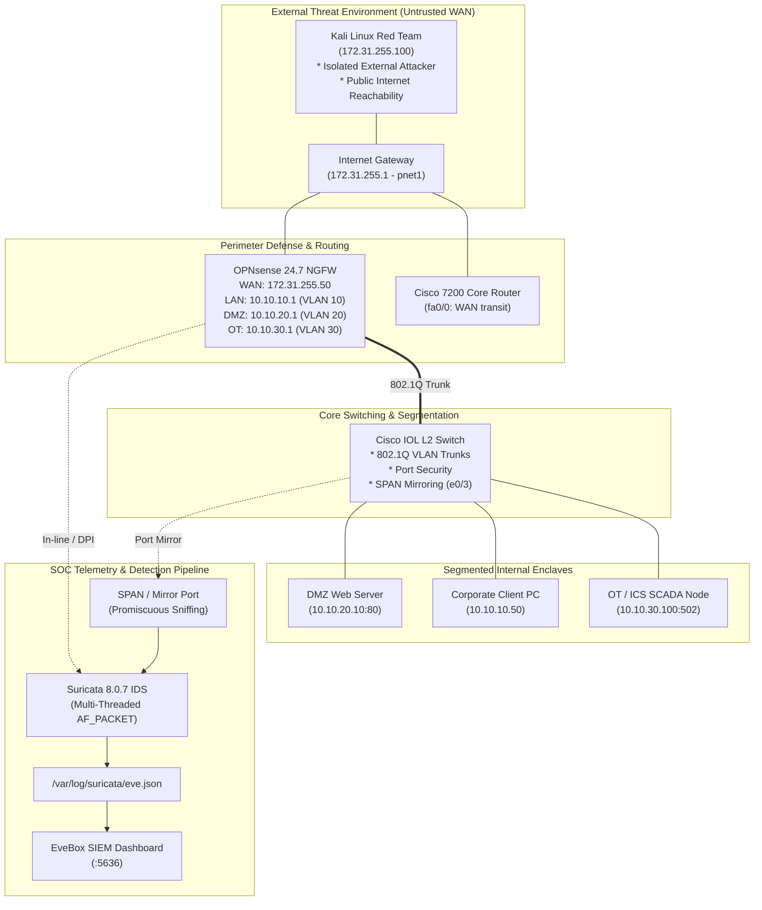
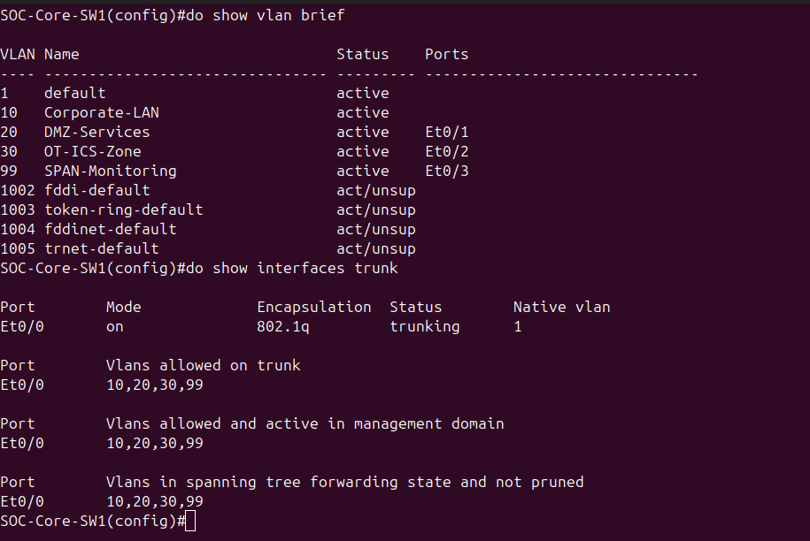
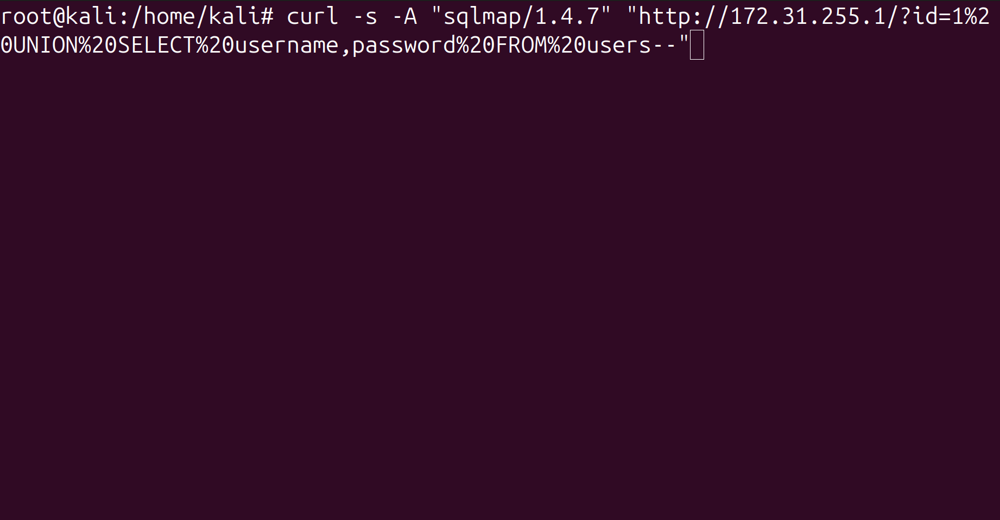
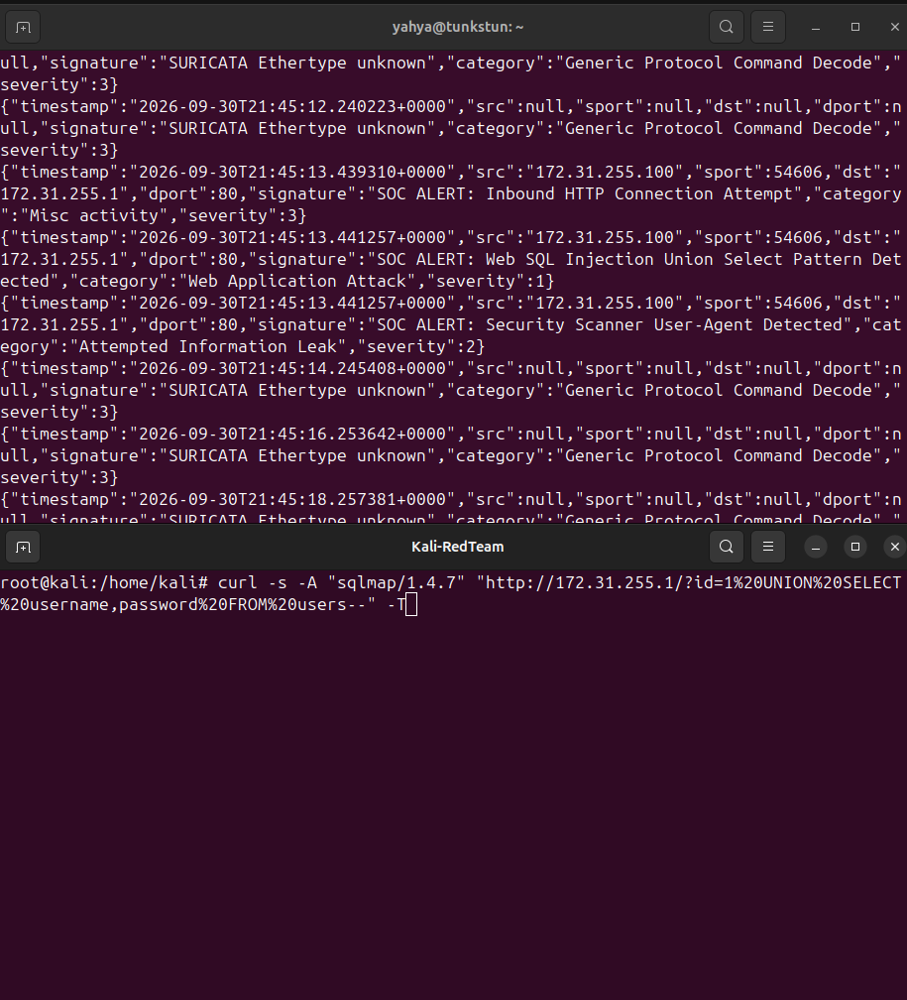
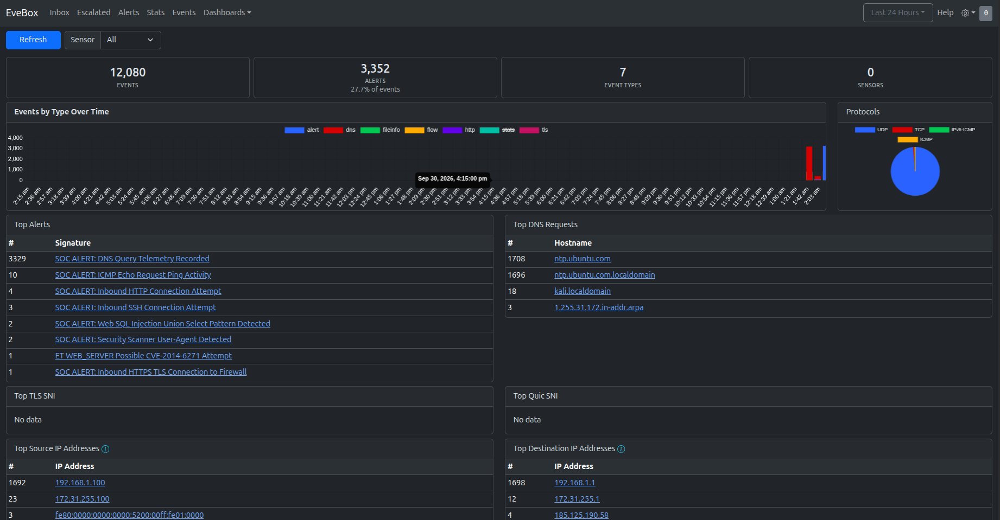
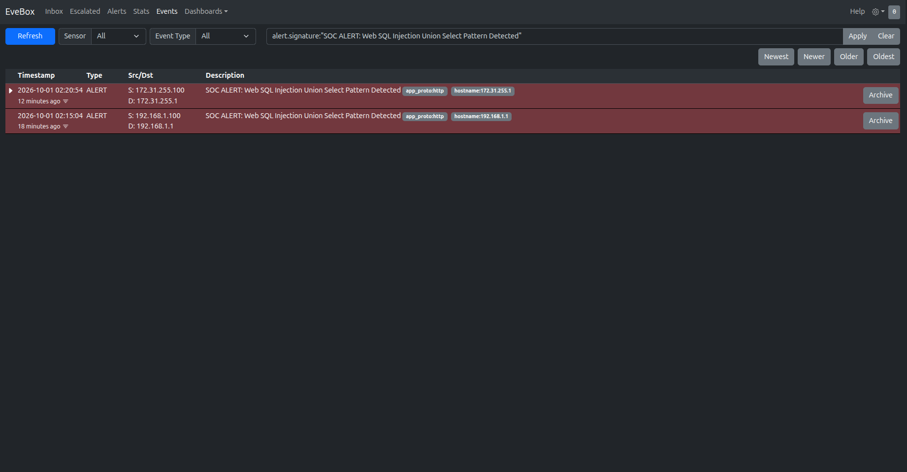
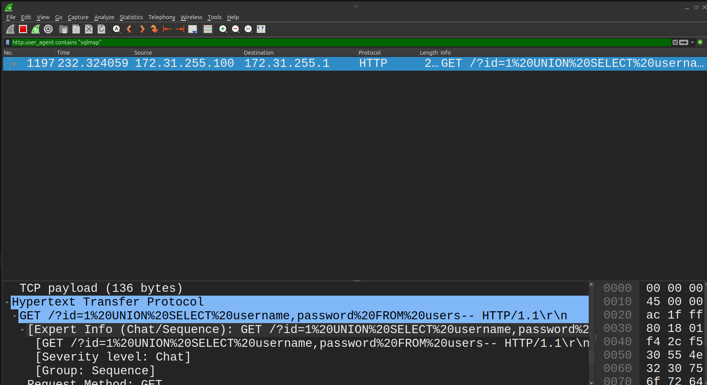

# Enterprise SOC Detection & Perimeter Engineering Home Lab
### EVE-NG • OPNsense 24.7 • Cisco IOS/IOL • Suricata 8.0.7 • EveBox SIEM • Kali Linux

A production-grade, automated Security Operations Center (SOC) Detection & Perimeter Engineering Home Lab virtualized inside EVE-NG on Linux KVM. Built for realistic adversary simulations, deep packet inspection (DPI), stateful firewalling, L2 switching security, and real-time SIEM alert triage.

[](https://www.eve-ng.net/)
[-orange.svg)](https://www.linux-kvm.org/)
[](https://opnsense.org/)
[](https://suricata.io/)
[](https://evebox.org/)
[](https://www.ansible.com/)

---

## Live Lab Topology & Zone Architecture



---

## Quick Navigation

- [Full Step-by-Step Live Deployment Tutorial](docs/TUTORIAL.md)
- [Adversary Simulation & Attack Catalog](docs/ATTACK_CATALOG.md)
- [SOC & Networking Core Study Notes (Plain .txt)](study/)
- [Node Configuration Files](configs/)
- [Ansible Automated Provisioning Playbooks](ansible/)
- [Lab Topologies & UNL Definitions](topologies/)
- [Snapshot & Disaster Recovery Scripts](snapshots/)
- [Client Integration & Access Guide](ACCESS_GUIDE.md)

---

## Architecture & Network Segmentation

The lab models a realistic enterprise perimeter with an isolated external threat actor attacking through the public Internet, a next-generation perimeter firewall, enterprise core switching, segmented internal enclaves, and an out-of-band SOC detection pipeline.



---

## Subnet & Addressing Plan

| Zone / Network | Subnet / CIDR | Gateway | Description |
| :--- | :--- | :--- | :--- |
| **External WAN** | `172.31.255.0/24` | `172.31.255.1` | Isolated untrusted network connecting Kali (`.100`) and Firewall WAN (`.50`) to the Internet |
| **Corporate LAN (VLAN 10)** | `10.10.10.0/24` | `10.10.10.1` | Internal corporate workstations and domain assets (`10.10.10.50`) |
| **DMZ Web (VLAN 20)** | `10.10.20.0/24` | `10.10.20.1` | Publicly exposed DMZ web servers & reverse proxies (`10.10.20.10:80`) |
| **OT / ICS (VLAN 30)** | `10.10.30.0/24` | `10.10.30.1` | Critical Industrial Control Systems & Modbus PLCs (`10.10.30.100:502`) |
| **Management (VLAN 99)** | `10.10.99.0/24` | `10.10.99.1` | Out-of-band management and SPAN port mirror destination |

---

## Core Switching & VLAN Segmentation

The Cisco Core Switch segments internal enterprise domains and provides SPAN port mirroring out to the Suricata inspection engine:



---

## Adversary Attack Simulation & Live Detection

Adversary emulation is executed from the isolated Kali Red Team node (`172.31.255.100`) across the WAN perimeter:



### Real-Time Suricata IDS Alert Log Stream (`eve.json`):



---

## Real-Time SIEM Event Triage (EveBox)

Suricata 8.0.7 forwards all telemetry to the **EveBox SIEM Dashboard** (`:5636`) for threat hunting and incident triage:



### Alert Deep Dive (Layer 7 SQL Injection Payload Inspection):



---

## Deep Packet Inspection (Wireshark)

Deep packet inspection (DPI) verifies protocol compliance, TCP handshake lifecycles, and byte-level payload signatures on the wire:



---

## Core Study Notes (`study/`)

Direct, plain-text reference notes covering foundational concepts:
- [`study/networking_fundamentals.txt`](study/networking_fundamentals.txt) - OSI model, IPv4 subnetting, RFC 1918, ARP, 802.1Q VLANs.
- [`study/tcp_ip_packet_analysis.txt`](study/tcp_ip_packet_analysis.txt) - 3-way handshake, TCP flags (SYN/ACK/PSH/FIN/RST), 4-way teardown, Wireshark filters.
- [`study/cisco_routing_switching.txt`](study/cisco_routing_switching.txt) - CAM table operation, Rapid-PVST, PortFast, BPDU Guard, OSPF Area 0.
- [`study/span_port_mirroring.txt`](study/span_port_mirroring.txt) - Local SPAN, RSPAN, ERSPAN, Promiscuous taps vs switch SPAN.
- [`study/opnsense_firewall_concepts.txt`](study/opnsense_firewall_concepts.txt) - Stateful packet inspection, state tables, NAT/PAT, `pfctl` commands.
- [`study/suricata_ids_detection.txt`](study/suricata_ids_detection.txt) - Multi-threading architecture, AF_PACKET, ET Open rule anatomy, `eve.json` structure.
- [`study/soc_telemetry_siem.txt`](study/soc_telemetry_siem.txt) - SOC Analyst Tier 1/2 triage lifecycle, EveBox alert triage, false positive tuning.
- [`study/adversary_attack_techniques.txt`](study/adversary_attack_techniques.txt) - MITRE ATT&CK mapping for Nmap, Hydra, SQLi, and C2.
- [`study/wireshark_attack_analysis.txt`](study/wireshark_attack_analysis.txt) - Wireshark display filters for detecting SYN scans, SQLi, Shellshock, brute-force, and tshark CLI analysis.

---

## Quick Start

### 1. Check Lab & Hypervisor Status
```bash
./status.sh
```

### 2. Manage EVE-NG VM (Start / Stop / Status)
```bash
./manage-eve.sh status
./manage-eve.sh start
```

### 3. Access Web Dashboards
- **EveBox SIEM Dashboard**: `http://<HYPERVISOR_IP>:5636`
- **EVE-NG Topology Web GUI**: `http://<HYPERVISOR_IP>` (Admin / `eve`)
- **OPNsense Firewall Web GUI**: `https://<HYPERVISOR_IP>:8443` (root / `opnsense`)

### 4. Run Automated Adversary Attack Simulation
```bash
# Connect to Kali node via telnet
telnet <HYPERVISOR_IP> 32772

# Execute attack script against the perimeter
./configs/kali-redteam-attack.sh 172.31.255.1
```

### 5. Automated Snapshots & Disaster Recovery
```bash
./snapshots/create-snapshot.sh baseline-clean "Clean initial state with all nodes configured"
./snapshots/list-snapshots.sh
./snapshots/restore-snapshot.sh baseline-clean
```

---

## License & Masked Infrastructure Notice
All configuration templates and playbooks in this repository use RFC 1918 placeholder addresses (`192.168.1.X`, `172.31.255.X`, `10.10.X.X`) to safeguard production credentials while ensuring 100% reproducible deployment.
