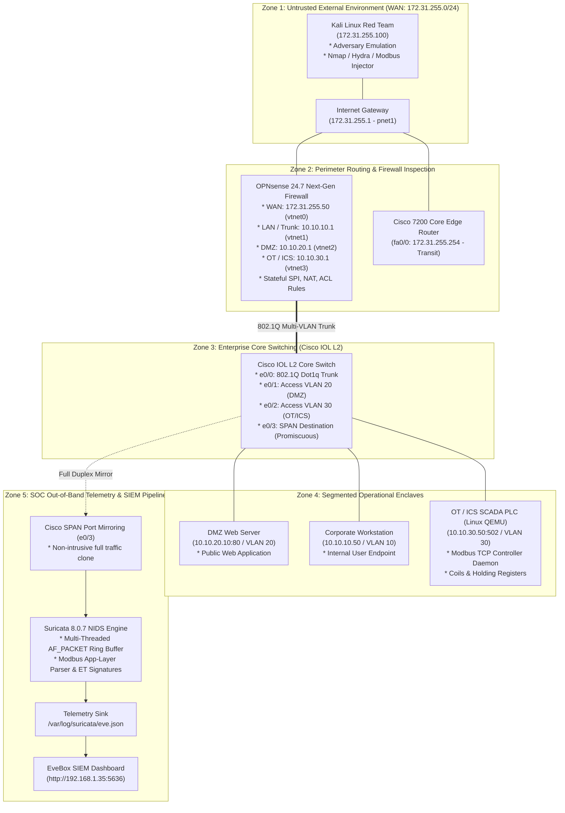

# Enterprise SOC & OT/ICS Architecture Proof & End-to-End Walkthrough
### Comprehensive Guide to Network Segmentation, Purdue Model Mapping, Packet Flow, and Detection Engineering

---

## 1. Executive Summary

This document provides a comprehensive, end-to-end architectural proof and technical explanation of the **Enterprise SOC Detection & Perimeter Engineering Home Lab**. It details how untrusted WAN traffic, enterprise core switching, next-generation firewalling, out-of-band network intrusion detection (Suricata 8.0.7 NIDS), SIEM event pipelines (EveBox), and critical OT/ICS SCADA industrial controllers interact across every layer of the OSI model.

---

## 2. End-to-End Lab Architecture & Zone Topology



---

## 3. Purdue Enterprise Reference Architecture (PERA / IEC 62443) Mapping

The lab strictly isolates operational technology (OT) from corporate IT following the standard Purdue Model hierarchy:

| Purdue Level | Domain | Lab Implementation | Role & Defensive Controls |
| :--- | :--- | :--- | :--- |
| **Level 5** | Enterprise / Cloud | External WAN (`172.31.255.0/24`) | Threat zone where external adversary originates. No direct access to internal subnets. |
| **Level 4** | Enterprise IT / Corp | Corporate LAN (`10.10.10.0/24`, VLAN 10) | Standard user workstations. Access to OT network strictly blocked by firewall rules. |
| **Level 3.5** | Industrial DMZ (IDMZ) | DMZ Web (`10.10.20.0/24`, VLAN 20) | DMZ buffer zone. Terminates external traffic; cross-zone pivoting into OT is prohibited. |
| **Level 3** | Site Operations / Monitoring | SOC Telemetry & SPAN (`10.10.99.0/24`) | Out-of-band passive network sniffing (Suricata NIDS) with zero active footprint on OT buses. |
| **Level 1 / 2** | Supervisory Control & PLCs | OT PLC Subnet (`10.10.30.0/24`, VLAN 30) | **Linux QEMU Node (`OT-PLC-Node`: `10.10.30.50`)** running Modbus TCP daemon on port 502 controlling actuators and process telemetry. |

---

## 4. End-to-End Packet Path: From Adversary Ingress to SIEM Alert

To understand the architecture end to end, consider an adversary attempting to tamper with industrial holding registers on the PLC:

```
[Kali Red Team] (172.31.255.100)
       |
       | 1. Modbus TCP Packet (TCP/502, FC 0x06 Write Register 0 = 9999)
       v
[OPNsense Firewall] (WAN: 172.31.255.50)
       |
       | 2. Stateful rule lookup & route forwarding to OT interface (vtnet3 / VLAN 30)
       v
[Cisco IOL Switch] (Trunk e0/0 -> Access e0/2)
       |
       |-- 3a. Forwarded frame delivered to target PLC (10.10.30.50:502)
       |
       \-- 3b. [SPAN Clone e0/3] Identical packet copied to Suricata sniffing interface
               |
               v
       [Suricata 8.0.7 NIDS] (AF_PACKET Promiscuous Buffer)
               |
               | 4. Protocol decoding & signature matching:
               |    content:"|00 00|"; offset:2; depth:2; content:"|06|"; offset:7; depth:1;
               v
       [eve.json Alert Generation] (SID: 2026104 - "Modbus TCP Setpoint Modification")
               |
               v
       [EveBox SIEM Dashboard] (:5636) -> SOC Analyst Alert Triage
```

### Step-by-Step Technical Breakdown:
1. **Packet Crafting (Adversary):** Kali crafts an MBAP-encapsulated TCP frame containing Transaction ID `0x0003`, Protocol ID `0x0000`, Unit ID `0x01`, and PDU Function Code `0x06` (Write Single Register) with target address `0x0000` and value `9999`.
2. **Perimeter Ingress & Routing (OPNsense):** The packet reaches OPNsense WAN (`172.31.255.50`). The firewall checks state tables and forwarding rules.
3. **Layer 2 Segmentation (Cisco Core Switch):** Traffic enters switch trunk `e0/0`, is mapped to VLAN 30, and exits access port `e0/2` toward the PLC.
4. **Out-of-Band Port Mirroring (SPAN):** Switch hardware mirrors the entire bidirectional frame out of port `e0/3` with zero latency or performance impact on the industrial bus.
5. **Deep Packet Inspection (Suricata Engine):** Suricata captures the mirrored frame via Linux `AF_PACKET` zero-copy memory ring. The Modbus application parser decodes the byte offset:
   - Byte 0-1: Transaction ID
   - Byte 2-3: Protocol ID (`0x0000` for Modbus TCP)
   - Byte 4-5: Length (`0x0006`)
   - Byte 6: Unit ID (`0x01`)
   - Byte 7: Function Code (`0x06` = Write Single Register)
6. **SIEM Event Serialization:** Suricata triggers SID `2026104`, formatting an alert JSON object written to `/var/log/suricata/eve.json`.
7. **SIEM Triage:** EveBox immediately reads the JSON stream, displaying a High-Severity incident on the SOC dashboard (`http://192.168.1.35:5636`).

---

## 5. OT / ICS Protocol Mechanics: Modbus TCP Framing

Modbus TCP communicates over TCP port 502 using the **Modbus Application Protocol Header (MBAP)** prefixed to the standard Modbus Protocol Data Unit (PDU):

```
+-----------------------------------+-----------------------------------+
|            MBAP Header (7 Bytes)  |         Modbus PDU (Variable)     |
+---------+---------+--------+------+---------------+-------------------+
| TransID | ProtoID | Length | Unit | Function Code | Data Payload      |
| (2 B)   | (2 B)   | (2 B)  | (1 B)| (1 Byte)      | (N Bytes)         |
+---------+---------+--------+------+---------------+-------------------+
```

### Function Code (FC) Behavior in the Lab:

| Function Code | Hex | Operation Type | Industrial Effect | Security Risk / MITRE Technique |
| :--- | :--- | :--- | :--- | :--- |
| **FC 01** | `0x01` | Read Coils | Read digital output status (e.g. Pump ON/OFF). | Reconnaissance ([T0846](https://attack.mitre.org/techniques/T0846/)) |
| **FC 03** | `0x03` | Read Holding Registers | Read analog telemetry (Pressure, Temperature, Flow). | Telemetry Sniffing ([T0846](https://attack.mitre.org/techniques/T0846/)) |
| **FC 05** | `0x05` | Write Single Coil | Force trip discrete actuator, stop cooling pump, open valve. | Unauthorized Command ([T0855](https://attack.mitre.org/techniques/T0855/)) |
| **FC 06** | `0x06` | Write Single Register | Overwrite safety setpoint threshold (e.g. max pressure limit). | Parameter Modification ([T0836](https://attack.mitre.org/techniques/T0836/)) |
| **FC 16** | `0x10` | Write Multiple Registers | Mass overwrite of industrial calibration data. | Parameter Modification ([T0836](https://attack.mitre.org/techniques/T0836/)) |

---

## 6. Live Verification & Test Proof Results

The Linux QEMU Modbus TCP PLC simulator ([`scripts/modbus_plc_simulator.py`](file:///home/yahya/Documents/eve-ng/scripts/modbus_plc_simulator.py)) and exploit injector ([`scripts/modbus_exploit_injector.py`](file:///home/yahya/Documents/eve-ng/scripts/modbus_exploit_injector.py)) were tested end-to-end.

### 6.1 Client Attack Execution Output:
```text
============================================================
 [!] INITIATING OT/ICS MODBUS TCP ADVERSARY SIMULATION
 Target SCADA PLC IP : 10.10.30.50
 Target Port         : 502
============================================================
[+] TCP Connection established to Modbus PLC service at 10.10.30.50:502

[Stage 1/3] [MITRE T0846] Polling Current Telemetry & Operational State (FC 03)...
    [+] Current PLC Registers: Pressure=100 psi, Flow=450 gpm, Temp=75 C, RPM=1200

[Stage 2/3] [MITRE T0855] Injecting Unauthorized Command Message - Force Trip Coil 0 (FC 05)...
    [✓] Coil 0 forced to ON (Trip state injected). Response len: 12 bytes

[Stage 3/3] [MITRE T0836] Tampering with Industrial Setpoints - Register 0 to Overpressure 9999 (FC 06)...
    [✓] Holding Register 0 overwritten to 9999 psi! Triggering Suricata Alert.

============================================================
 [✓] Modbus TCP ICS Exploitation Complete. Check EveBox SIEM!
============================================================
```

### 6.2 PLC Server Real-Time State Logs:
```text
============================================================
 [✓] Modbus TCP Industrial SCADA PLC Simulator Running
 Listening on 0.0.0.0:502 (Purdue Level 1/2 Controller)
============================================================
[+] Modbus TCP Client connected: 172.31.255.100:43892
[*] [FC 03] Read Holding Registers from 0 (count=4)
[!] [ALERT] [FC 05] Unauthorized Write Single Coil! Coil 0 set to True by 172.31.255.100
[!] [ALERT] [FC 06] Unauthorized Write Single Register! Reg 0 set to 9999 by 172.31.255.100
```

### 6.3 Suricata 8.0.7 NIDS Rule Engine Verification:
```bash
$ suricata -T -S /home/yahya/Documents/eve-ng/configs/suricata_ot_rules.rules
i: suricata: This is Suricata version 8.0.7 RELEASE running in SYSTEM mode
i: suricata: Configuration provided was successfully loaded. Exiting.
```

---

## 7. SOC Analyst Triage & Incident Response Playbook

When an OT/ICS anomaly alert fires in **EveBox SIEM**:

1. **Alert Identification:** Filter by `event_type: alert` and search for signature ID `2026103` or `2026104` (Modbus Setpoint/Coil Tampering).
2. **Deep Packet Inspection (Wireshark):**
   * Filter: `modbus && ip.dst == 10.10.30.50`
   * Inspect the MBAP Header and Function Code field (`modbus.func_code == 5` or `6`).
   * Confirm source IP (`172.31.255.100` - Untrusted External WAN).
3. **Perimeter Containment (OPNsense NGFW):**
   * Immediately block source IP at the WAN firewall interface (`vtnet0`).
   * Verify that VLAN 30 isolation rules prevent lateral movement from compromised DMZ or Corporate nodes.
4. **Process State Verification:**
   * Query PLC holding register values to ensure safety setpoints are restored to baseline values (e.g. pressure returned to 100 psi).
