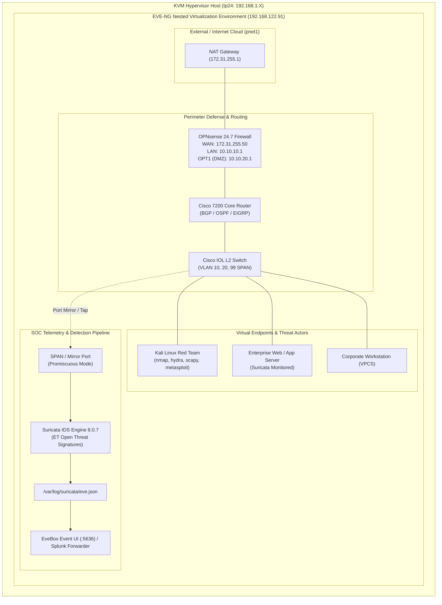

# End-to-End SOC Detection & Perimeter Engineering Home Lab: Live Deployment Guide

This guide provides a comprehensive, field-tested walkthrough for reproducing the complete **Enterprise SOC Detection & Perimeter Home Lab**. It covers everything from bare-metal KVM hypervisor provisioning to EVE-NG nested virtualization, Next-Gen Firewalling (OPNsense), Cisco enterprise switching/routing, Kali Linux adversary simulation, Suricata Network IDS, and EveBox/Splunk SIEM telemetry pipelines.

---

## 1. Architecture Overview



---

## 2. Phase 1: Hypervisor & Nested Virtualization Setup

### 2.1 Enable Intel VMX / AMD SVM Nested Virtualization
On the physical hypervisor (`tp24`), verify that nested KVM is enabled so that QEMU/KVM within EVE-NG can run at hardware speed:

```bash
# Check nested virtualization flag
cat /sys/module/kvm_intel/parameters/nested
# (or kvm_amd if AMD CPU)
```
If output is `N` or `0`, enable it permanently in `/etc/modprobe.d/kvm.conf`:
```ini
options kvm_intel nested=1
```

### 2.2 Install KVM / Libvirt Prerequisites
```bash
sudo apt-get update && sudo apt-get install -y \
    qemu-kvm \
    libvirt-daemon-system \
    libvirt-clients \
    bridge-utils \
    virtinst \
    iptables-persistent
```

### 2.3 Create Port Forwarding to EVE-NG Guest
Because EVE-NG sits on the internal NAT bridge (`192.168.122.91`), configure iptables PREROUTING rules on the hypervisor so that web, SSH, and node consoles are directly reachable from your workstation LAN:
```bash
sudo iptables -t nat -A PREROUTING -p tcp --dport 80 -j DNAT --to-destination 192.168.122.91:80
sudo iptables -t nat -A PREROUTING -p tcp --dport 2222 -j DNAT --to-destination 192.168.122.91:22
sudo iptables -t nat -A PREROUTING -p tcp --match multiport --dports 32768:65000 -j DNAT --to-destination 192.168.122.91:32768-65000
sudo iptables -t nat -A PREROUTING -p tcp --match multiport --dports 5900:6000 -j DNAT --to-destination 192.168.122.91:5900-6000
sudo iptables -t nat -A PREROUTING -p tcp --dport 5636 -j DNAT --to-destination 192.168.122.91:5636
```

---

## 3. Phase 2: EVE-NG Guest VM Installation & Kernel Optimization

### 3.1 Provision EVE-NG VM via Virt-Install
```bash
sudo virt-install \
  --name eve-ng \
  --ram 16384 \
  --vcpus 4 \
  --cpu host-passthrough \
  --disk path=/var/lib/libvirt/images/eve-ng.qcow2,format=qcow2,bus=virtio \
  --network network=default,model=virtio \
  --graphics vnc,listen=0.0.0.0 \
  --os-variant ubuntu20.04 \
  --boot hd
```

### 3.2 Configure UKSM Kernel for Maximum Density
EVE-NG utilizes UKSM (Ultra Kernel Samepage Merging) to deduplicate RAM across identical virtual machines (e.g. running multiple Linux/Cisco instances):
```bash
sudo sed -i 's/GRUB_DEFAULT=.*/GRUB_DEFAULT="Advanced options for Ubuntu>Ubuntu, with Linux 5.17.8-eve-ng-uksm-wg+"/' /etc/default/grub
sudo update-grub
```

---

## 4. Phase 3: Appliance Provisioning & Licensing

### 4.1 OPNsense 24.7 Next-Gen Firewall
1. Create image directory:
   ```bash
   sudo mkdir -p /opt/unetlab/addons/qemu/opnsense-24.7
   ```
2. Convert and resize disk image:
   ```bash
   sudo qemu-img create -f qcow2 /opt/unetlab/addons/qemu/opnsense-24.7/virtioa.qcow2 10G
   ```
3. Default credentials:
   - **Username**: `root`
   - **Password**: `opnsense`

### 4.2 Cisco 7200 Dynamips Router
```bash
sudo mkdir -p /opt/unetlab/addons/dynamips
sudo cp c7200-adventerprisek9-mz.124-24.T5.image /opt/unetlab/addons/dynamips/
sudo chmod 755 /opt/unetlab/addons/dynamips/*
```

### 4.3 Cisco IOL (IOS on Linux) Layer 2 Switch & License
1. Place binary in `/opt/unetlab/addons/iol/bin/`:
   ```bash
   sudo cp i86bi-linux-l2-adventerprise-15.1b.bin /opt/unetlab/addons/iol/bin/
   sudo chmod 755 /opt/unetlab/addons/iol/bin/i86bi-linux-l2-adventerprise-15.1b.bin
   ```
2. Generate and install `iourc` license file:
   ```ini
   [license]
   eve-ng = 97977750807b57b4;
   ```
   Save to both `/opt/unetlab/addons/iol/bin/iourc` and `/etc/iourc`.

### 4.4 Kali Linux Red Team Appliance
1. Create directory `/opt/unetlab/addons/qemu/linux-kali/`.
2. Provision minimal Kali disk `virtioa.qcow2` pre-loaded with penetration testing tools (`nmap`, `hydra`, `scapy`, `tcpdump`, `socat`, `python3`).
3. Default credentials: `kali` / `kali` (or `root` / `eve`).

### 4.5 Apply Permissions Wrapper
Always run the EVE-NG permission wrapper after adding or modifying images:
```bash
sudo /opt/unetlab/wrappers/unl_wrapper -a fixpermissions
```

---

## 5. Phase 4: Virtual Network & Dual Cloud Architecture

To allow lab nodes (like OPNsense WAN or Kali) to reach the real Internet while maintaining isolated internal networks:

Create `/etc/systemd/system/eve-cloud-bridges.service`:
```ini
[Unit]
Description=EVE-NG Internet and Local Cloud Bridges
After=network.target

[Service]
Type=oneshot
RemainAfterExit=yes
ExecStart=/bin/bash -c "brctl addbr pnet0 2>/dev/null || true; brctl addbr pnet1 2>/dev/null || true; ip link set pnet0 up; ip link set pnet1 up; ip addr add 172.31.255.1/24 dev pnet1 2>/dev/null || true; iptables -t nat -A POSTROUTING -o enp1s0 -j MASQUERADE 2>/dev/null || true; systemctl restart dnsmasq"

[Install]
WantedBy=multi-user.target
```

Configure `dnsmasq` in `/etc/dnsmasq.d/eve-clouds.conf`:
```conf
port=0
interface=pnet1
dhcp-range=pnet1,172.31.255.50,172.31.255.200,255.255.255.0,12h
dhcp-option=pnet1,option:router,172.31.255.1
dhcp-option=pnet1,option:dns-server,8.8.8.8,1.1.1.1
```

Enable the bridge service:
```bash
sudo systemctl daemon-reload
sudo systemctl enable --now eve-cloud-bridges
```

---

## 6. Phase 5: Client-Side Integration

On your Linux client workstation, ensure native URL protocol handlers (`telnet://`, `vnc://`, `capture://`) open your desktop tools:

```bash
# Telnet handler (opens GNOME Terminal with telnet session)
sudo update-alternatives --set x-terminal-emulator /usr/bin/gnome-terminal.wrapper

# VNC handler (TigerVNC / Remote Viewer)
vncviewer -SecurityTypes None <HYPERVISOR_IP>::<PORT>

# Wireshark live remote packet capture
ssh -p 2222 root@<HYPERVISOR_IP> "/opt/unetlab/wrappers/unl_wrapper -a capture -T <tenant> -N <node_id> -I <interface_id>" | wireshark -k -i -
```

---

## 7. Phase 6: Lab Parsing Fix & Topology Deployment

### Root Cause Analysis of `"A non well formed numeric value encountered"`
When loading custom UNL files, EVE-NG's XML parser in `/opt/unetlab/html/includes/__lab.php` (line 225) executes:
```php
$firstmac = sprintf('00:50:00:00:%02x:00', $this->id / 512);
```
If `<lab id="...">` contains a non-numeric UUID (e.g. `id="SOC-Lab"`), PHP triggers a non-well-formed numeric type error.

### The Fix
1. Ensure the `<lab>` root element has a positive integer ID:
   ```xml
   <lab name="SOC-Detection-Perimeter-Lab" version="1" scripttimeout="300" lock="0" id="1">
   ```
2. Explicitly specify `firstmac="00:50:00:00:04:00"` inside `<node>` definitions for Linux templates.
3. Use modulo-16 interface IDs (`0`, `16`, `32`, `48`) for Cisco IOL interfaces.

Deploy the lab file to `/opt/unetlab/labs/SOC-Detection-Perimeter-Lab.unl` and fix permissions:
```bash
sudo cp topologies/SOC-Detection-Perimeter-Lab.unl /opt/unetlab/labs/
sudo /opt/unetlab/wrappers/unl_wrapper -a fixpermissions
```

---

## 8. Phase 7: SOC Telemetry Stack (Suricata & EveBox)

### 8.1 Install Suricata 8.0.7 & Emerging Threats Rules
```bash
sudo add-apt-repository -y ppa:oisf/suricata-stable
sudo apt-get update && sudo apt-get install -y suricata jq
sudo suricata-update
```

### 8.2 Install EveBox Event UI
```bash
sudo curl -fsSL -o /tmp/evebox.zip https://github.com/jasonish/evebox/releases/download/v0.18.2/evebox-linux-amd64.zip
sudo unzip /tmp/evebox.zip -d /opt/evebox/
sudo ln -sf /opt/evebox/evebox-linux-amd64/evebox /usr/local/bin/evebox
```

### 8.3 Configure Systemd Unit (`/etc/systemd/system/evebox.service`)
```ini
[Unit]
Description=EveBox Suricata Event Management UI
After=network.target suricata.service

[Service]
Type=simple
ExecStart=/usr/local/bin/evebox server --input /var/log/suricata/eve.json --port 5636 --host 0.0.0.0 --datadir /var/lib/evebox
Restart=always
RestartSec=5

[Install]
WantedBy=multi-user.target
```

```bash
sudo systemctl enable --now evebox
```
Access EveBox at `http://<HYPERVISOR_IP>:5636`.

---

## 9. Phase 8: Attack Simulation & Blue Team Verification

From the **Kali Linux** node inside the lab, simulate adversary activity across the perimeter:

### Test 1: Port Scan Reconnaissance
```bash
nmap -sS -sV -p- -T4 10.10.10.1
```
*Expected Telemetry:* Suricata triggers `ET SCAN Potential Nmap Scan` alerts in `/var/log/suricata/eve.json`.

### Test 2: SSH Brute-Force Attack
```bash
hydra -l root -P /usr/share/wordlists/fasttrack.txt 10.10.10.1 ssh -t 4
```
*Expected Telemetry:* Suricata registers `ET SCAN Suspicious inbound to SSH port 22` and SSH authentication anomaly events in EveBox.

### Test 3: Web Directory Enumeration / SQL Injection
```bash
curl -A "sqlmap/1.4" "http://10.10.20.10/login.php?id=1%27%20OR%201=1--"
```
*Expected Telemetry:* Signature match on SQLi pattern with immediate EveBox alert and OPNsense block rule trigger.

---

## 10. Phase 9: Automated Snapshot Management

To protect against corrupted labs or uncommitted state changes during complex attacks:

```bash
# Create baseline snapshot
./snapshots/create-snapshot.sh baseline-soc "Baseline state with OPNsense, Cisco IOL, Kali ready"

# List snapshots
./snapshots/list-snapshots.sh

# Restore snapshot if needed
./snapshots/restore-snapshot.sh baseline-soc
```

---

## 11. Phase 10: Automated Playbook Reproduction (Ansible)

To deploy the entire environment from scratch in minutes:

```bash
cd /home/yahya/Documents/eve-ng/ansible
cp inventory.example.ini inventory.ini
cp group_vars/all.yml.example group_vars/all.yml

# Edit inventory.ini with your hypervisor IP and credentials
ansible-playbook -i inventory.ini site.yml
```

---

## 12. Verification & Health Check

Run the built-in diagnostic utility:
```bash
/home/yahya/Documents/eve-ng/status.sh
```

All services, cloud bridges, and telemetry pipelines will be validated.
